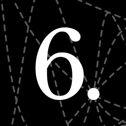

Sixdot
======

Very basic dice roller that uses Godot's 3D physics engine (take that `randf`). The intent of this at the moment is to be used when playing DnD over a video call (and using something like OBS to capture the dice tray window and display it next to your webcam input).

https://github.com/EvergreenTheTree/Sixdot/assets/3642781/bef93c73-b3c0-4169-b59c-4a5389b236de

## Wishlist

In no particular order:
- [ ] Mobile support
- [ ] Web embedding support
- [ ] Wider array of collision sounds that are randomly selected from
- [ ] Collect results above the tray into a row / grid (would involve actually being able to tell how to orient the dice so the number on top is right side up)
- [ ] Implement some kind of automatic calculation (would involve actually being able to detect which number is face up and potentially a simple dice expression DSL or UI builder)
- [ ] Make it possible to change text dice textures separately from the texture of the rest of the dice
- [ ] More dice themes and make custom ones easy
- [ ] Bump-mapping (or whatever it's called) to make text look engraved
- [ ] Improve how dice are rolled to mimic how a normal human (tm) would roll a bunch of dice at once (would maybe involve UI for adding dice to your hand before rolling first)
- [ ] Dynamic tray sizes
- [ ] UI that isn't ugly as sin
